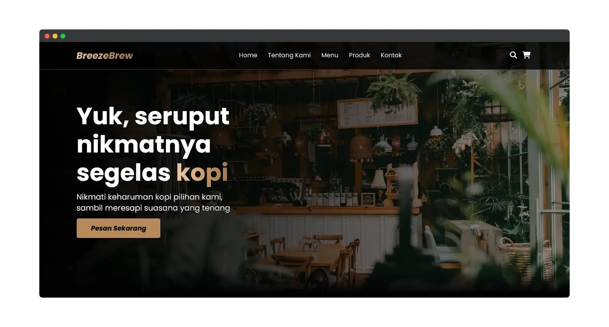

# _Breeze Brew_ 
   

Welcome to Breeze Brew, where the aroma of freshly brewed coffee meets the tranquility of a serene ambiance. This project is a stylish and user-friendly website for a coffee shop, designed to provide an immersive experience for coffee enthusiasts.

  

# Tech Stack

 
 

# Collaborator
> [!NOTE]  
> <b>I am currently working on a project in collaboration with my friend, [@nndda](https://github.com/nndda)</b>

